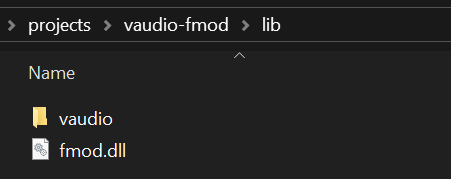

## Vercidium Audio + OpenAL Soft Example

This repository requires the Vercidium Audio SDK v1.1.1 and OpenAL Soft to run:
- Download the Vercidium Audio SDK from [vercidium.com/audio](https://vercidium.com/audio)
- Download the OpenAL Soft DLL from [github.com/kcat/openal-soft](https://github.com/kcat/openal-soft/releases/tag/1.25.1)

> Please note that the Vercidium Audio SDK is not free for commercial use. See [vercidium.com/audio](https://vercidium.com/audio)

## OpenAL Soft Setup

Once OpenAL Soft is downloaded, copy the `openal-soft-1.25.1-bin\openal-soft-1.25.1-bin\bin\Win64\soft_oal.dll` file to the `lib` folder.

## Vercidium Audio Setup

You can either copy the entire vaudio folder to the `lib` folder:



Or edit `vaudio-openal.csproj` to point to the folder where the Vercidium Audio SDK lives:

```xml
<PropertyGroup>
    <!-- Replace this with the path to your vaudio SDK -->
    <VAudioDir>lib\vaudio</VAudioDir>
</PropertyGroup>
```

## File Overview

- `resource/audio/speech.ogg` is an example file included for playback
- `Scene.cs` creates a Vercidium Audio context and initialises an OpenAL device

Scene.cs is where you can adjust ray counts, add primitives change materials and more. See the [Vercidium Audio docs](https://docs.vercidium.com/raytraced-audio/v110/Getting+Started) for more.

## Controls

Open the project in Visual Studio 2022 or 2026, and press F5 to run the project.

A debug window will appear, which renders the raytracing scene (primitives and rays), an echogram at the top, and raytracing stats in the bottom left.

- Use WASD and the mouse to move the camera
- Press escape to release the mouse
- Press shift/control to increase camera speed

