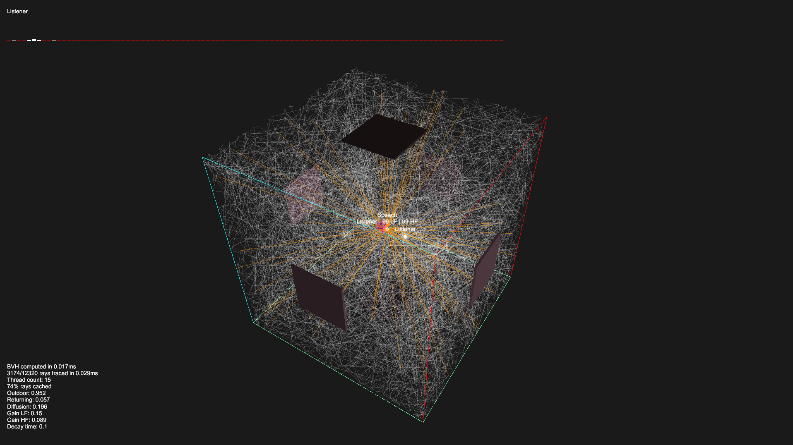

## Vercidium Audio + OpenAL Soft Example

This repository requires the Vercidium Audio SDK v1.2.0 and OpenAL Soft to run:
- Download the Vercidium Audio SDK from [vercidium.com](https://vercidium.com)
- Download the OpenAL Soft DLL from [github.com/kcat/openal-soft](https://github.com/kcat/openal-soft/releases/tag/1.25.1)

> Please note that the Vercidium Audio SDK is not free for commercial use. See [vercidium.com/eula](https://vercidium.com/eula)

## OpenAL Soft Setup

Download OpenAL Soft from the link above, then copy the `openal-soft-1.25.1-bin/bin/Win64/soft_oal.dll` file to the `vaudio-openal/lib` folder.

## Vercidium Audio Setup

Edit `vaudio-openal.csproj` to point to the folder where the Vercidium Audio SDK lives:

```xml
<ItemGroup>
	<Reference Include="vaudio">
		<!-- Step 2 - replace this with the path to your Vercidium Audio .NET SDK -->
		<HintPath>path\to\your\dotnet\vaudio.dll</HintPath>
	</Reference>
</ItemGroup>
```

## File Overview

- `resource/audio/speech.ogg` is an example file included for playback
- `Scene.cs` creates a Vercidium Audio context and initialises an OpenAL device

Scene.cs is where you can adjust ray counts, add primitives, change materials and more. See the [Vercidium Audio docs](https://vercidium.com/docs) for more details.

## Controls

Open the project in Visual Studio 2022 or 2026, and press F5 to run the project.

A debug window will appear that displays:
- the raytracing scene (primitives and rays)
- an echogram at the top
- raytracing stats in the bottom left.

Controls:

- Use WASD and the mouse to move the camera
- Press escape to release the mouse
- Press shift/control to increase camera speed

